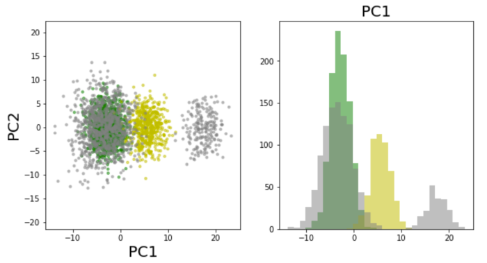
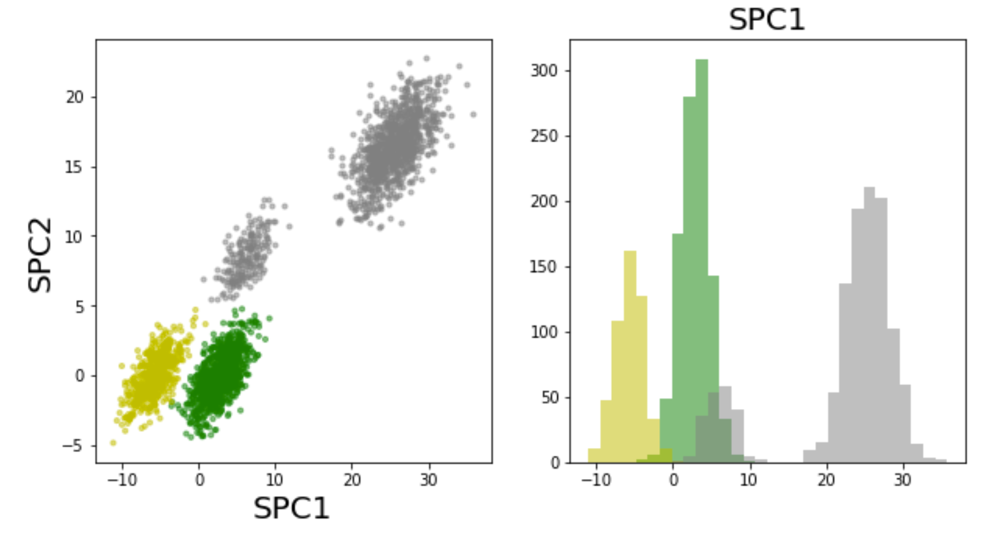
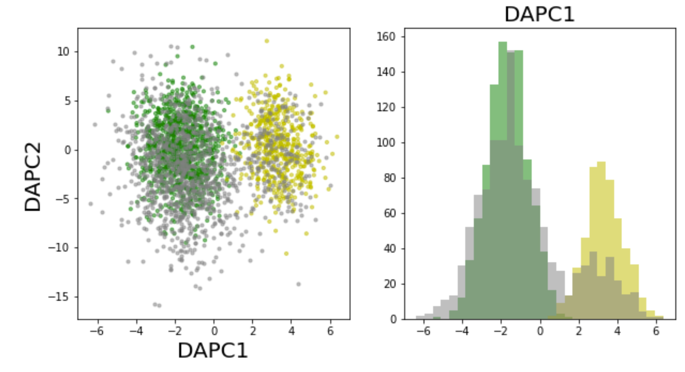

# DAPCA

Domain adaptation PCA method introduced in [https://www.mdpi.com/1099-4300/23/8/1090]. 

## Installation

Copy DAPCA.py or DAPCA.m specify the path to it. 

## Dependencies (Python)

* numpy
* sklearn
* pynndescent
* matplotlib
* numbers
* warnings
* abc

## Example of use

### Importing libraries

    import numpy as np
    import matplotlib.pyplot as plt
    from sklearn.decomposition import PCA
    from DAPCA import DAPCA

### Loading the example data

    X = np.loadtxt('datasets/synthetic/2clusters/2clusters_3d/X.csv',delimiter=',')
    Y = np.loadtxt('datasets/synthetic/2clusters/2clusters_3d/Y.csv',delimiter=',')
    labels = np.loadtxt('datasets/synthetic/2clusters/2clusters_3d/labels.csv',delimiter=',')
    cls = ['g','y','grey']
    labels_c = [cls[int(i)-1] for i in labels]
    labelsXY_c = labels_c + ['grey']*np.sum(Y.shape[0])
    n_points1 = np.sum(labels==1.0)
    n_points2 = np.sum(labels==2.0)
    
### Running PCA, SPCA and DAPCA

    pca = PCA(svd_solver='full')
    u = pca.fit_transform(X)
    mn = np.mean(X,axis=0)
    #PY = (Y-mn)@pca.components_
    PY = pca.fit_transform(Y)

    nbins = 30

    plt.subplots(1,2,figsize=(10,5))

    # Do PCA
    plt.subplot(121)
    plt.scatter(u[:,0],u[:,1],c=labels_c,alpha=0.5,s=10)
    plt.scatter(PY[:,0],PY[:,1],c='grey',alpha=0.5,s=10)
    plt.xlabel('PC1',fontsize=20)
    plt.ylabel('PC2',fontsize=20)
    plt.axis('equal')
    plt.subplot(122)
    rng = (np.min((np.min(u[:,0]),np.min(PY[:,0]))),np.max((np.max(u[:,0]),np.max(PY[:,0]))))
    plt.hist(u[0:n_points1,0],bins=nbins,color='g',alpha=0.5,range=rng)
    plt.hist(u[n_points1:n_points1+n_points2,0],bins=nbins,color='y',alpha=0.5,range=rng)
    #plt.hist(u[n_points[0]+n_points[1]:,0],bins=nbins,color='grey',alpha=0.5,density=True)
    plt.hist(PY[:,0],bins=nbins,color='grey',alpha=0.5,range=rng)
    plt.title('PC1',fontsize=20)
    plt.show()

    # ======================= PARAMETERS OF DAPCA ===========================
    alpha = 1
    num_comps = 2
    gamma = 200
    maxIter = 10
    beta = 1
    kNN = 1
    # =======================================================================

    # Compute Supervised PCA (SPCA)
    [V1, D1, PX, PY, kNNs] = DAPCA(X, labels, 2, alpha=alpha)
    PX_SPCA = PX.copy()
    V1_SPCA = V1.copy()

    plt.subplots(1,2,figsize=(10,5))

    mn = np.mean(X,axis=0)
    PY = (Y-mn)@V1

    if num_comps>1:
        plt.subplot(121)
        plt.scatter(PX[:,0],PX[:,1],c=labels_c,alpha=0.5,s=10)
        plt.scatter(PY[:,0],PY[:,1],c='grey',alpha=0.5,s=10)
        plt.xlabel('SPC1',fontsize=20)
        plt.ylabel('SPC2',fontsize=20)
        #plt.axis('equal')

    plt.subplot(122)
    rng = (np.min((np.min(PX[:,0]),np.min(PY[:,0]))),np.max((np.max(PX[:,0]),np.max(PY[:,0]))))
    plt.hist(PX[:n_points1,0],bins=nbins,color='g',alpha=0.5,range=rng)
    plt.hist(PX[n_points1:n_points1+n_points2,0],bins=nbins,color='y',alpha=0.5,range=rng)
    plt.hist(PY[:,0],bins=nbins,color='grey',alpha=0.5,range=rng)
    plt.title('SPC1',fontsize=20)
    plt.show()

    # We will use initial neighbourhood relations as in 2D PCA
    initialV = pca.components_[:num_comps,:].T
    if num_comps==1:
        initialV = initialV.reshape(-1,1)

    plt.subplots(1,2,figsize=(10,5))

    # Compute DAPCA
    [V1, D1, PX, PY, kNNs] = DAPCA(X, labels, num_comps,  YY=Y, 
                             alpha=alpha, gamma=gamma,maxIter=maxIter,
                                   beta=beta,verbose='all',kNN=kNN,
                                   initialV = initialV,eps=1e-10)                                   

    if PX.shape[1]>1:
        plt.subplot(121)
        plt.scatter(PX[:,0],PX[:,1],c=labels_c,alpha=0.5,s=10)
        plt.scatter(PY[:,0],PY[:,1],c='grey',alpha=0.5,s=10)
        plt.xlabel('DAPC1',fontsize=20)
        plt.ylabel('DAPC2',fontsize=20)
        #plt.axis('equal')

    plt.subplot(122)
    rng = (np.min((np.min(PX[:,0]),np.min(PY[:,0]))),np.max((np.max(PX[:,0]),np.max(PY[:,0]))))
    plt.hist(PX[:n_points1,0],bins=nbins,color='g',alpha=0.5,range=rng)
    plt.hist(PX[n_points1:n_points1+n_points2,0],bins=nbins,color='y',alpha=0.5,range=rng)
    plt.hist(PY[:,0],bins=nbins,color='grey',alpha=0.5,range=rng)
    plt.title('DAPC1',fontsize=20)
    plt.show()
    
### Expected output

